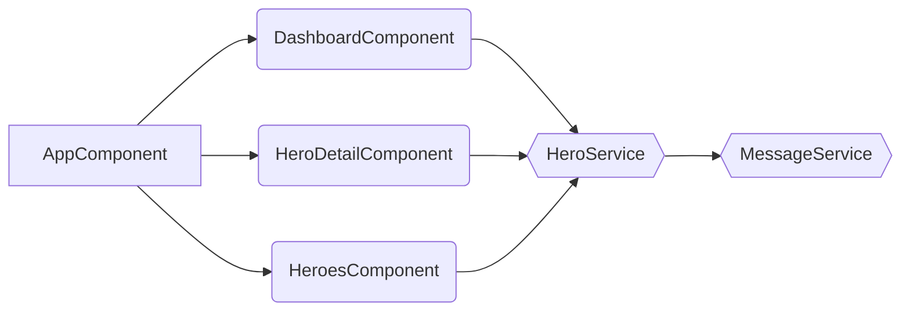

# @tsharp/ng-component-hierarchy-visualizer

<a href="https://www.npmjs.com/package/@tsharp/ng-component-hierarchy-visualizer" rel="nofollow"></a>


Generate Mermaid representations of your Angular component hierarchy representation based on the route configurations.

## Features

- Visualize Angular component hierarchy using Mermaid.js.
- Supports eagerly and lazily loaded components.

## Installation

```bash
npm install -g @tsharp/ng-component-hierarchy-visualizer
```
## Usage
Navigate to the directory that contains the toplevel routes.

```bash
cd src/app
generate-hierarchy [path-to-routes-file]
```
Defaults to `app.routes.ts` if no [path-to-routes-file] is provided.

## Example
go to https://stackblitz.com/edit/bqtvoz?file=package.json
```
cd src/app
npm run generate-hierarchy
```
copy output to https://mermaid.live/

# Output
Generates Mermaid Flowcharts that can be used directly in github and everywhere else where [mermaid is rendered natively](https://mermaid.js.org/ecosystem/integrations-community.html#community-integrations).


Or it can be pasted into the mermaid live editor:
[Mermaid JS](https://mermaid.live/edit#pako:eNqNkU1PhDAQhv8KmRMmsNktHyU9mBg5ePC2N6mHEboLEVpSiroS_rt1dV0UkvU27zPTZybpALkqBDDY1eo1L1EbLm_a9lY1rZJCGpJN06Pj-9dOil35pFAXP9ydo6vLnjuhVSoMVvVZtMD-aRLdb8skW8P8wGyOzrKt0C9VLtxJbSULx2UL7Etzr3I0lZLuqfgWTO7K_uRL-7kEDxqhG6wK-2UDl47DwZSiERyYLQvUzxy4HO0c9kZtDzIHZnQvPNCq35en0LcFGpFWuNfYANth3VnaogQ2wBswP0nIKgxCmlAaJDENAw8OwCKyspHQMCaWbsjowbtSVmCHoyCi63gdBsS-2xxlD8fe58bxAyrP17w)

# Known Limitations
At this stage the library does have several limitations:

- Complex Route Configurations:

    The library may not handle very complex route configurations. If routes contain variable routes, the accuracy of the extracted routes and components might be compromised.

- Service Detection:

    Detection of services is limited to those directly injected into components or those explicitly imported. Services injected via more dynamic or indirect methods may not be detected and included in the dependency graph. It also does not work with path aliases.

- Recursion Depth:

    The library has a fixed recursion depth for detecting nested dependencies, which is set to prevent infinite loops and excessive memory consumption. Very deep or complex dependency chains might not be fully resolved.

- Path Resolution:

    Path resolution relies on the current working directory. If the project structure is unusual or if symbolic links are involved, the path resolution might fail, leading to errors or incomplete graphs.

- Mermaid Diagram Complexity:

    For very large applications with many routes and dependencies, the generated Mermaid diagrams can become overly complex and difficult to read. Users might need to manually simplify or segment the diagrams for better clarity.

## Contributing
Contributions are welcome! Please open an issue or submit a pull request for any changes.
