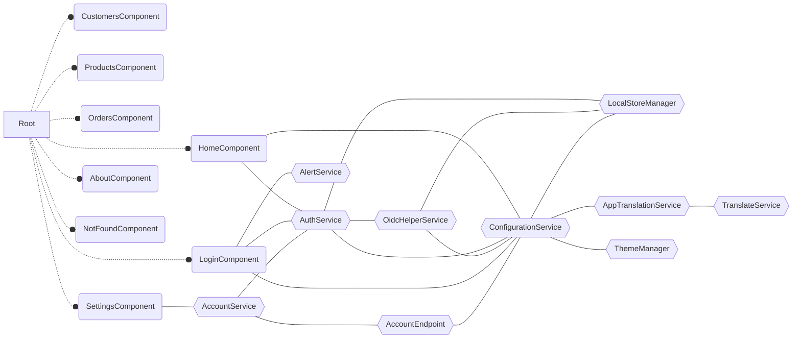

# @tsharp/ng-component-hierarchy-visualizer

<a href="https://www.npmjs.com/package/@tsharp/ng-component-hierarchy-visualizer" rel="nofollow"></a>
<a href="https://github.com/timonkrebs/ng-component-hierarchy-visualizer/actions/workflows/node.js.yml" rel="nofollow"></a>

Generate Mermaid representations of your Angular component hierarchy representation based on the route configurations.

## Features

- Visualize Angular routing component hierarchy using Mermaid.js.
- Supports eagerly and lazily loaded components.
- Optionally include services in the visualization.

## Usage
Navigate to the directory that contains the routes from which the graph should be generated.

```bash
cd src/app
npx @tsharp/ng-component-hierarchy-visualizer ng-route-hierarchy [path-to-routes-file] --withServices
```
- Defaults to `app.routes.ts` if no [path-to-routes-file] is provided.
- Use --withServices to include injected services in the output. (ignores Angular services for clarity)
- Use --withNestedDependencies to include importet standalone elements (components, pipes, directives) in the output. (ignores Angular elements for clarity)
- Use --basePath=<relativePathfromCwd> to execute from this location.

## Example
1. go to [Stackblitz](https://stackblitz.com/github/emonney/QuickApp?file=quickapp.client%2Fsrc%2Fapp%2Fapp.routes.ts) and run:
```
npx @tsharp/ng-component-hierarchy-visualizer ng-route-hierarchy app.routes.ts --withServices --basePath=quickapp.client/src/app
```
2. Find file Component-Diagram.mmd
3. copy output to [Mermaid JS](https://mermaid.live/edit#pako:eNqtlMFvmzAYxf8V5NMmhQgIEMotylb1kK1T01PFxbUdYgn8Icfu1qH87zNJE-xCW0Xdjffye59fbEyLCFCGcrSp4DfZYqm81V0h7gCU50998G6gZkuoGxBMqC-O-mpzKyi56EFXOuRS75QZI3c9PbScxC8JVBNlBQaOw99K6ox_pR12zZTiorTogePwi0fQqodd6ZA_QV2DFrSHB47hnR31fN_3Flpt10w-ccLa1hL7_Ri9BLHhpZZYcRDn2Jjb5a1xh_Qtp-SGVQ2T5-jAGst9btUVEFytFUj2AwtcMtm2A6vLDar8h_Rlzcf8i0q8OWDRNPcSi13lFhm13x10v2V1X8JWh60fm3fMvdjsvPZrp8u79_jYvGJS9YUt9VbgnRd6BL_shAa39bgkIeaiWS0dfdgYx_mw5xh-tL4L2gAX6rzIybBiJ-vi_4cmyHwWa8yp-US3hfC8AqnuiAuUm0fKNlhXqkCF6FCsFayfBUG5kppNkARdblG-wdXOKN1Qc7bfOC4lrk9Ig8UDgC1R3qI_KA-D2XQeJ0GYZGl0NZ9FVxP0jPIoiqZJFoVpnIZBmEXJbD9Bfw8TgmkWx0mcBUlqfknTYL7_B_V8XcE)

# Output
Generates Mermaid Flowcharts that can be used directly in github and everywhere else where [mermaid is rendered natively](https://mermaid.js.org/ecosystem/integrations-community.html#community-integrations).


Or it can be pasted into the mermaid live editor:
[Mermaid JS](https://mermaid.live/edit#pako:eNqtlMFvmzAYxf8V5NMmhQgIEMotylb1kK1T01PFxbUdYgn8Icfu1qH87zNJE-xCW0Xdjffye59fbEyLCFCGcrSp4DfZYqm81V0h7gCU50998G6gZkuoGxBMqC-O-mpzKyi56EFXOuRS75QZI3c9PbScxC8JVBNlBQaOw99K6ox_pR12zZTiorTogePwi0fQqodd6ZA_QV2DFrSHB47hnR31fN_3Flpt10w-ccLa1hL7_Ri9BLHhpZZYcRDn2Jjb5a1xh_Qtp-SGVQ2T5-jAGst9btUVEFytFUj2AwtcMtm2A6vLDar8h_Rlzcf8i0q8OWDRNPcSi13lFhm13x10v2V1X8JWh60fm3fMvdjsvPZrp8u79_jYvGJS9YUt9VbgnRd6BL_shAa39bgkIeaiWS0dfdgYx_mw5xh-tL4L2gAX6rzIybBiJ-vi_4cmyHwWa8yp-US3hfC8AqnuiAuUm0fKNlhXqkCF6FCsFayfBUG5kppNkARdblG-wdXOKN1Qc7bfOC4lrk9Ig8UDgC1R3qI_KA-D2XQeJ0GYZGl0NZ9FVxP0jPIoiqZJFoVpnIZBmEXJbD9Bfw8TgmkWx0mcBUlqfknTYL7_B_V8XcE)

# Known Limitations
At this stage the library does have some limitations:

- **Optimised for Standalone**: Modules only get parsed for the routes.
- **Path Resolution**: Unusual project structures may cause resolution issues.

## Detective
Check out [Detective](https://github.com/angular-architects/detective) for even more insights into your Angular/TS Apps.

```shell
npx @softarc/detective detective
```

## Contributing
Contributions are welcome! Please open an issue or submit a pull request for any changes.
