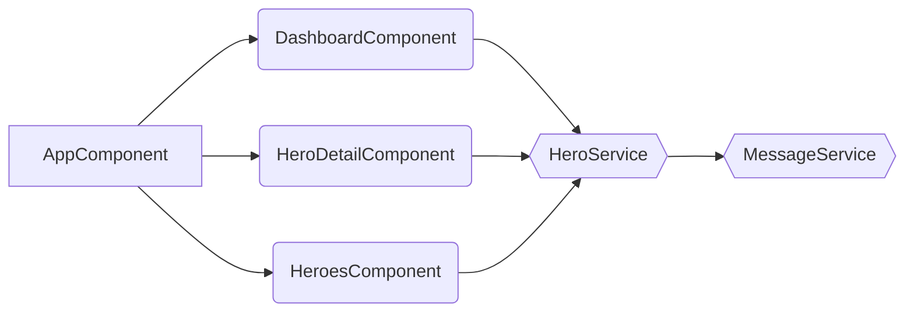

# @tsharp/ng-component-hierarchy-visualizer

<a href="https://www.npmjs.com/package/@tsharp/ng-component-hierarchy-visualizer" rel="nofollow"></a>
<a href="https://github.com/timonkrebs/ng-component-hierarchy-visualizer/actions/workflows/node.js.yml" rel="nofollow"></a>

Generate Mermaid representations of your Angular component hierarchy representation based on the route configurations.

## Features

- Visualize Angular routing component hierarchy using Mermaid.js.
- Supports eagerly and lazily loaded components.
- Optionally include services in the visualization.

## Installation
Install the package globally using npm:
```bash
npm install -g @tsharp/ng-component-hierarchy-visualizer
```
## Usage
Navigate to the directory that contains the routes from which the graph should be generated.

```bash
cd src/app
ng-route-hierarchy [path-to-routes-file] --withServices
```
- Defaults to `app.routes.ts` if no [path-to-routes-file] is provided.
- Use --withServices to include injected services in the output. (ignores Angular services for clarity)
- Use --withNestedTemplateElements to include importet standalone elements (components, pipes, directives) in the output. (ignores Angular elements for clarity)
- Use --basePath=<relativePathfromCwd> to execute from this location.

## Example
1. go to https://stackblitz.com/edit/bqtvoz-emxakr?file=package.json
2. wait until dependencies are installed and run following commands in the stackblitz terminal
```
cd src/app
npm run ng-route-hierarchy
```
3. copy output to https://mermaid.live/

# Output
Generates Mermaid Flowcharts that can be used directly in github and everywhere else where [mermaid is rendered natively](https://mermaid.js.org/ecosystem/integrations-community.html#community-integrations).


Or it can be pasted into the mermaid live editor:
[Mermaid JS](https://mermaid.live/edit#pako:eNqNkU1PhDAQhv8KmRMmsNktHyU9mBg5ePC2N6mHEboLEVpSiroS_rt1dV0UkvU27zPTZybpALkqBDDY1eo1L1EbLm_a9lY1rZJCGpJN06Pj-9dOil35pFAXP9ydo6vLnjuhVSoMVvVZtMD-aRLdb8skW8P8wGyOzrKt0C9VLtxJbSULx2UL7Etzr3I0lZLuqfgWTO7K_uRL-7kEDxqhG6wK-2UDl47DwZSiERyYLQvUzxy4HO0c9kZtDzIHZnQvPNCq35en0LcFGpFWuNfYANth3VnaogQ2wBswP0nIKgxCmlAaJDENAw8OwCKyspHQMCaWbsjowbtSVmCHoyCi63gdBsS-2xxlD8fe58bxAyrP17w)

# Known Limitations
At this stage the library does have several limitations:

- **Complex Route Configurations**: The library may not handle very complex route configurations accurately, especially those involving variable routes.
- **Service Detection**: Limited to services directly injected into components or explicitly imported. It may not detect dynamically injected services.
- **Recursion Depth**: The library has a fixed recursion depth for detecting nested dependencies, potentially missing very deep or complex chains.
- **Path Resolution**: Unusual project structures or symbolic links may cause resolution issues.
- **Mermaid Diagram Complexity**: Large applications may produce complex diagrams that are difficult to read.

## Contributing
Contributions are welcome! Please open an issue or submit a pull request for any changes.
