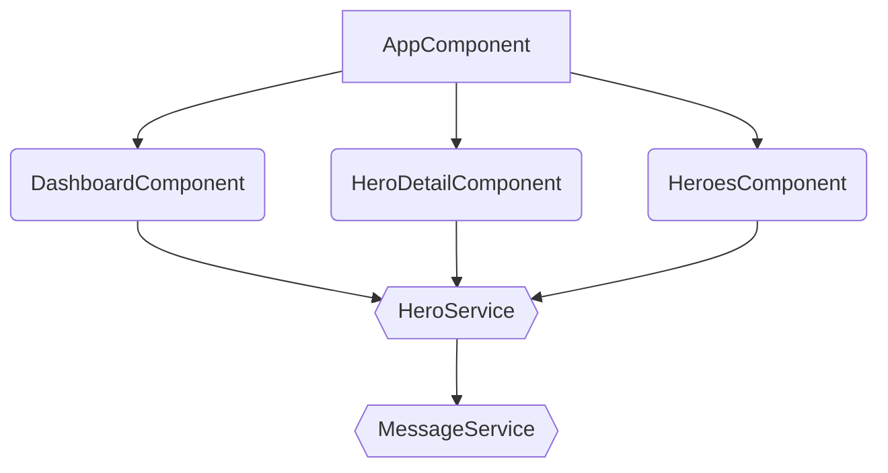

# @tsharp/ng-component-hierarchy-visualizer

Generate Mermaid representations of your Angular component hierarchy.

## Features

- Visualize Angular component hierarchy using Mermaid.js.
- Supports eagerly and lazily loaded components.

## Installation

```bash
npm install -g @tsharp/ng-component-hierarchy-visualizer
```
## Usage
Navigate to the directory that contains the toplevel routs.

```bash
cd src/app
generate-hierarchy [path-to-routes-file]
```
Defaults to `app.routes.ts` if no [path-to-routes-file] is provided.

## Example
go to https://stackblitz.com/edit/bqtvoz?file=package.json
```
cd src/app
npm run generate-hierarchy
```
copy output to https://mermaid.live/

# Output
Generates Mermaid Flowcharts that can be used directly in github etc.

Or it can be pasted into the mermaid live editor:
[Mermaid JS](https://mermaid.live/edit#pako:eNqNkU1PhDAQhv8KmRMmsNktHyU9mBg5ePC2N6mHEboLEVpSiroS_rt1dV0UkvU27zPTZybpALkqBDDY1eo1L1EbLm_a9lY1rZJCGpJN06Pj-9dOil35pFAXP9ydo6vLnjuhVSoMVvVZtMD-aRLdb8skW8P8wGyOzrKt0C9VLtxJbSULx2UL7Etzr3I0lZLuqfgWTO7K_uRL-7kEDxqhG6wK-2UDl47DwZSiERyYLQvUzxy4HO0c9kZtDzIHZnQvPNCq35en0LcFGpFWuNfYANth3VnaogQ2wBswP0nIKgxCmlAaJDENAw8OwCKyspHQMCaWbsjowbtSVmCHoyCi63gdBsS-2xxlD8fe58bxAyrP17w)

## Contributing
Contributions are welcome! Please open an issue or submit a pull request for any changes.
